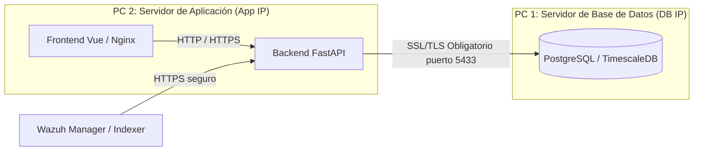

# Guía de Despliegue en 2 PCs Separadas (Conexión Segura SSL/TLS)

Esta guía detalla los pasos necesarios para separar físicamente la base de datos de la aplicación y asegurar el canal mediante SSL y restricciones de firewall, cumpliendo con las exigencias del profesor para la presentación en vivo.

---

## 📐 Arquitectura del Despliegue



---

## 📋 Requisitos Previos

1. Ambos equipos (**PC 1** y **PC 2**) deben estar conectados a la **misma red local** (ej: conectados al mismo router Wi-Fi o mediante un switch).
2. Obtener las direcciones IP locales de ambas PCs:
   * **En Windows:** Abre PowerShell/CMD y escribe `ipconfig`. Busca la IP en "Dirección IPv4" (ej. `192.168.1.50`).
   * **En Linux:** Abre una terminal y escribe `ip a` o `hostname -I`.

---

## 🛠️ Paso 1: Generar los Certificados SSL/TLS para la Base de Datos

Los certificados deben generarse en el computador que actuará como **PC 1 (Base de Datos)**.

### Opción A: En Windows (Recomendada si usas Docker Desktop)
Abre PowerShell en la carpeta raíz del proyecto y ejecuta:
```powershell
Set-ExecutionPolicy -Scope Process -ExecutionPolicy Bypass
.\dev-tools\generate-db-certs.ps1
```
*Esto utilizará un contenedor temporal de OpenSSL para crear los certificados sin instalar nada en tu sistema.*

### Opción B: En Linux / macOS
Abre la terminal en la carpeta raíz del proyecto y ejecuta:
```bash
chmod +x ./dev-tools/generate-db-certs.sh
./dev-tools/generate-db-certs.sh
```

**Resultado:** Se habrá creado la carpeta `./db-ssl` en la raíz de tu proyecto con los archivos:
* `ca.crt`: Certificado de la Entidad Certificadora Local.
* `ca.key`: Llave privada de la CA.
* `server.crt`: Certificado firmado para el servidor Postgres.
* `server.key`: Llave privada del servidor Postgres.

---

## 🗄️ Paso 2: Levantar la Base de Datos en la PC 1

1. En la **PC 1**, asegúrate de tener configurado tu archivo `.env` con las credenciales de Postgres.
2. Copia el archivo `prod_config/docker-compose.db.yml` a la raíz del proyecto renombrándolo a `docker-compose.yml`:
   ```bash
   # En Windows (PowerShell)
   Copy-Item prod_config/docker-compose.db.yml docker-compose.yml -Force

   # En Linux
   cp prod_config/docker-compose.db.yml docker-compose.yml
   ```
3. Levanta el contenedor de la Base de Datos:
   ```bash
   docker compose up -d --build
   ```
4. **Verificación:** Revisa que el contenedor inicie y que cargue el SSL. Ejecuta `docker logs db-api` y busca líneas similares a:
   ```text
   database system is ready to accept connections
   ```
   *(Cualquier error de permisos en la clave privada se resolverá automáticamente gracias a la copia interna a `/tmp` que hace el docker-compose).*

---

## 🧱 Paso 3: Configurar el Firewall en la PC 1 (Base de Datos)

Por seguridad (y requerimiento del issue), la PC de la Base de Datos debe bloquear cualquier conexión entrante en el puerto `5433` que no provenga de la **IP de la Aplicación (PC 2)**.

### Opción A: Si la PC 1 usa Windows Defender Firewall
Abre **PowerShell como Administrador** en la **PC 1** y ejecuta el siguiente comando (reemplaza `IP_DE_PC_APP_2` por la IP real de la PC 2):

```powershell
New-NetFirewallRule -DisplayName "Bloquear PostgreSQL Externo" -Direction Inbound -LocalPort 5433 -Protocol TCP -Action Block
New-NetFirewallRule -DisplayName "Permitir PostgreSQL a PC App" -Direction Inbound -LocalPort 5433 -Protocol TCP -RemoteAddress "IP_DE_PC_APP_2" -Action Allow
```

### Opción B: Si la PC 1 usa Linux (UFW)
Ejecuta en la terminal (reemplaza `IP_DE_PC_APP_2` por la IP real de la PC 2):
```bash
sudo ufw deny 5433/tcp
sudo ufw allow from IP_DE_PC_APP_2 to any port 5433 proto tcp
```

---

## 💻 Paso 4: Levantar la Aplicación en la PC 2

1. En la **PC 2**, edita el archivo `.env` en la raíz del proyecto.
2. Comenta las variables de host de base de datos individuales y define la variable `DATABASE_URL` apuntando a la **IP de la PC 1** y forzando el modo SSL `require`:
   ```env
   # Reemplaza IP_DE_PC_BD_1 con la IP real de la PC 1
   DATABASE_URL=postgresql://admin:password_seguro@IP_DE_PC_BD_1:5433/vulnerabilidades_db?sslmode=require
   ```
3. Copia el archivo `prod_config/docker-compose.app-only.yml` a la raíz del proyecto renombrándolo a `docker-compose.yml`:
   ```bash
   # En Windows (PowerShell)
   Copy-Item prod_config/docker-compose.app-only.yml docker-compose.yml -Force

   # En Linux
   cp prod_config/docker-compose.app-only.yml docker-compose.yml
   ```
4. Levanta la aplicación y el frontend:
   ```bash
   docker compose up -d --build
   ```
5. **Verificación:** Abre el navegador en `https://localhost` (o la IP de la PC 2) e inicia sesión. Ve al dashboard de vulnerabilidades. Si los datos se cargan correctamente, ¡la conexión cifrada a través de la red física está funcionando!

---

## 🧪 Pruebas de Seguridad en la Conexión

### 1. Confirmar que viaja cifrado por SSL/TLS
Para demostrarle al profesor que la base de datos exige y usa SSL, puedes conectarte al contenedor de la base de datos en la **PC 1** y correr la siguiente consulta SQL:

```bash
docker exec -it db-api psql -U admin -d vulnerabilidades_db -c "SELECT ssl, version, client_addr FROM pg_stat_ssl JOIN pg_stat_activity ON pg_stat_ssl.pid = pg_stat_activity.pid WHERE client_addr IS NOT NULL;"
```
*Si la columna `ssl` muestra `t` (true), significa que la conexión activa está encriptada.*

### 2. Confirmar bloqueo de conexiones no cifradas
Si intentas cambiar temporalmente la variable en la **PC 2** a `sslmode=disable` y reinicias el backend, las peticiones deberían fallar debido al script de inicialización `20-enforce-ssl.sh` que configuró `pg_hba.conf` para exigir SSL (`hostssl`).
